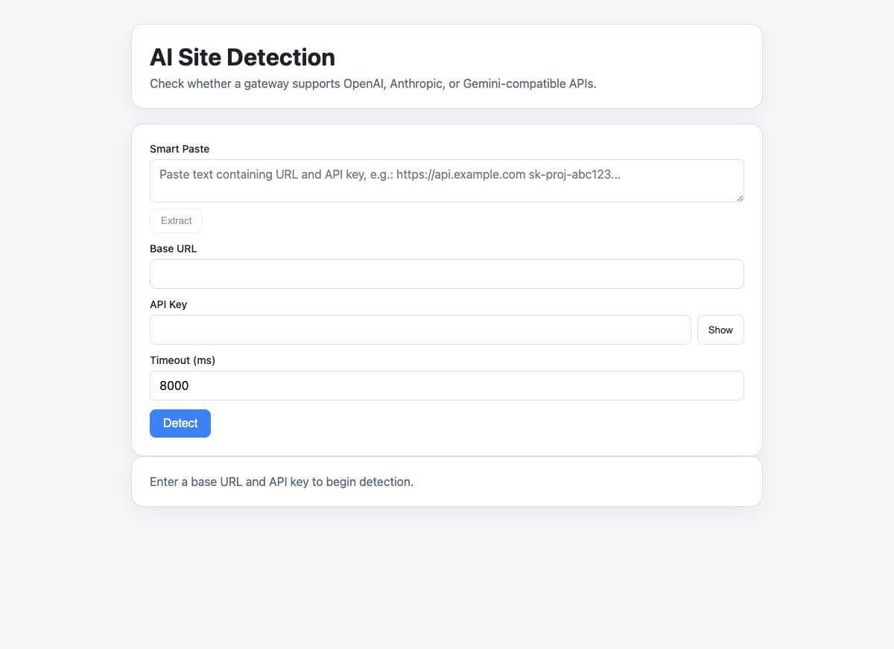
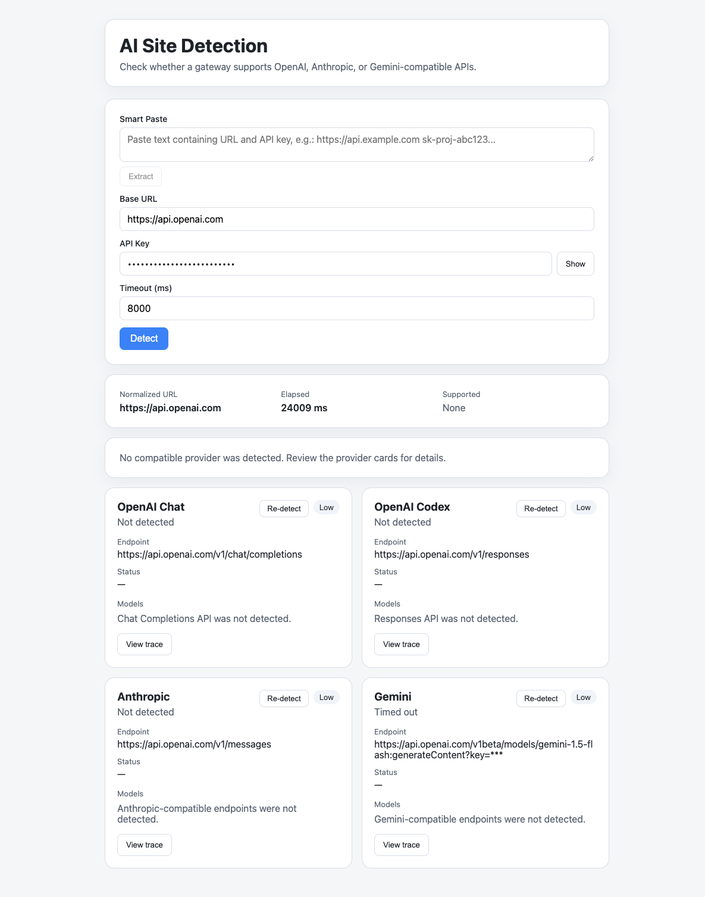
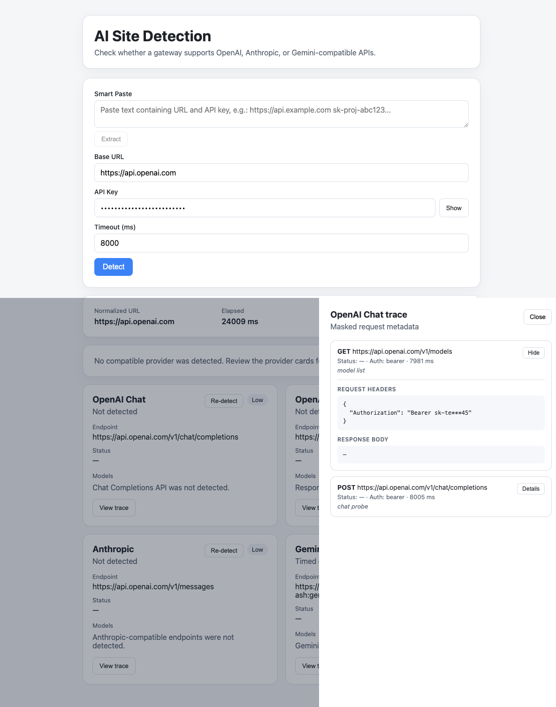

# AI Site Detection

[中文文档](./README.zh-CN.md)

Detect whether an API gateway supports OpenAI, Anthropic, or Gemini-compatible endpoints — by probing real HTTP requests.

## Screenshots

**Home — Enter Base URL and API Key:**



**Detection Results — Provider Cards with Re-detect:**



**Request Trace Drawer — Masked HTTP Details:**



## Features

- **Multi-provider detection** — OpenAI Chat, OpenAI Codex (Responses API), Anthropic, and Gemini
- **Single provider re-detection** — Re-detect any individual provider without re-running the full scan
- **Confidence scoring** — High / Medium / Low based on model list + endpoint probe results
- **Request tracing** — Full masked HTTP traces for every probe (headers, body, response)
- **Smart Paste** — Paste text containing a URL and API key, auto-extract both fields
- **Two deployment modes** — Full-stack (Vue + Fastify) or standalone Cloudflare Worker

## Architecture

```
├── shared/          # Shared TypeScript types (DetectRequest, ProviderDetectionResult, etc.)
├── server/          # Fastify API server (TypeScript)
│   └── src/
│       ├── providers/   # OpenAI / Anthropic / Gemini detector implementations
│       ├── services/    # detectAll / detectOne orchestrators
│       └── routes/      # POST /api/detect, POST /api/detect-one
├── web/             # Vue 3 + Vite frontend
│   └── src/
│       ├── api/         # API client (detectSite, detectOne)
│       └── components/  # DetectForm, ProviderCard, ResultSummary, RequestTraceDrawer
└── worker/          # Cloudflare Worker (single-file, self-contained)
    └── worker.js
```

## Quick Start

### Full-Stack Mode (Vue + Fastify)

```bash
# Install dependencies
npm install

# Start both frontend and backend in dev mode
make dev

# Or start them separately
make web     # Frontend only (Vite dev server on port 5173)
make server  # Backend only (Fastify on port 3000)
```

### Cloudflare Worker Mode

```bash
cd worker
npm install
npx wrangler dev worker.js
```

### Docker Deployment

```bash
# Build and start
cd deploy
docker-compose up -d

# View logs
docker-compose logs -f

# Stop
docker-compose down
```

Access at: http://localhost:3000

**Custom port:** Edit `deploy/docker-compose.yml`:
```yaml
ports:
  - "8080:3000"  # Map host port 8080 to container port 3000
```

**Environment variables:**

| Variable | Default | Description |
|----------|---------|-------------|
| `PORT` | `3000` | Server port |
| `HOST` | `0.0.0.0` | Server host |
| `NODE_ENV` | `production` | Node environment |

## API

### `POST /api/detect`

Full detection across all providers.

**Request:**

```json
{
  "baseUrl": "https://api.example.com",
  "apiKey": "sk-...",
  "timeoutMs": 8000
}
```

**Response:**

```json
{
  "ok": true,
  "normalizedBaseUrl": "https://api.example.com",
  "startedAt": "...",
  "finishedAt": "...",
  "results": [
    {
      "provider": "openai-chat",
      "supported": true,
      "confidence": "high",
      "models": ["gpt-4o-mini", "..."],
      "endpointTried": "https://api.example.com/v1/chat/completions",
      "statusCode": 200,
      "latencyMs": 342,
      "traces": [...]
    }
  ]
}
```

### `POST /api/detect-one`

Re-detect a single provider.

**Request:**

```json
{
  "baseUrl": "https://api.example.com",
  "apiKey": "sk-...",
  "provider": "anthropic",
  "timeoutMs": 8000
}
```

**Response:** A single `ProviderDetectionResult` object (same shape as one element in the `results` array above).

## Scripts

| Command | Description |
|---------|-------------|
| `make dev` | Start frontend + backend concurrently |
| `make web` | Start frontend dev server |
| `make server` | Start backend dev server |
| `make build` | Build both frontend and backend |
| `make test` | Run all tests |

## Tech Stack

- **Frontend:** Vue 3 + TypeScript + Vite
- **Backend:** Fastify + TypeScript
- **Worker:** Cloudflare Workers (vanilla JS)
- **Testing:** Vitest

## License

MIT
